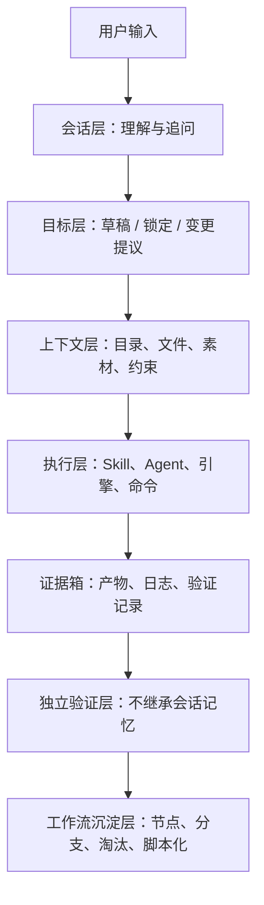
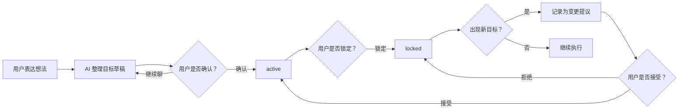
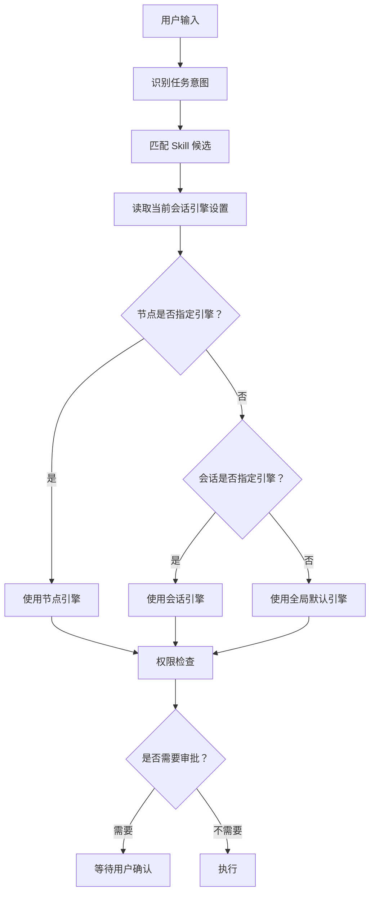
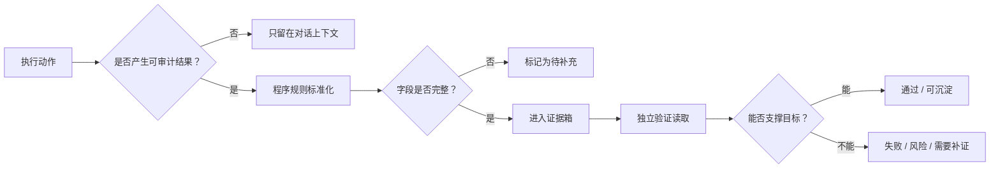
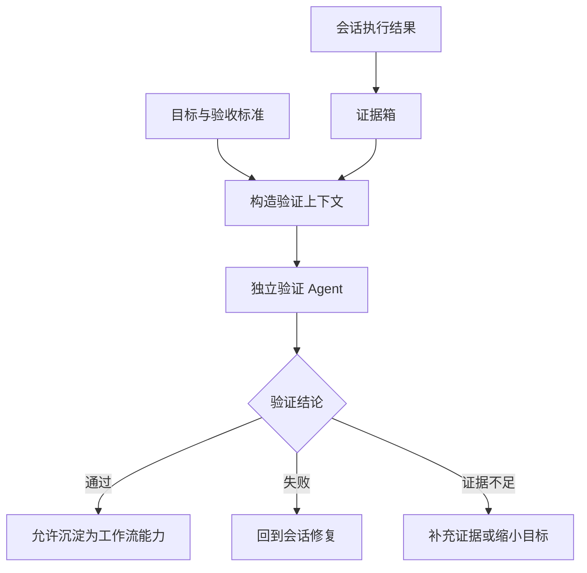
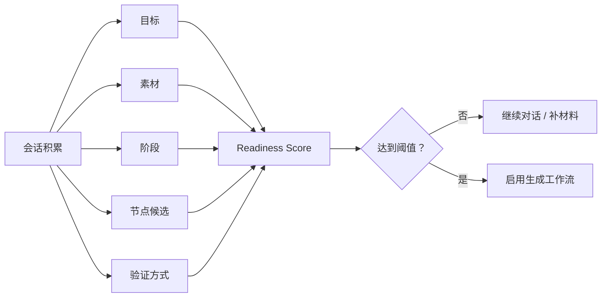
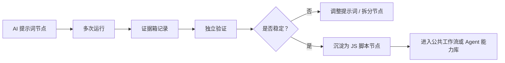
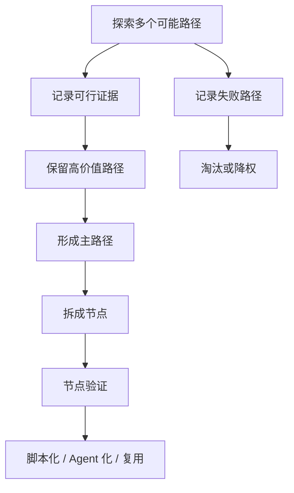

# KaKaAgent 会话、目标、证据箱与工作流沉淀设计 v0.1

## 1. 设计目的

KaKaAgent 的核心不是再做一个普通聊天窗口，而是让一次会话可以逐步沉淀成可复用、可验证、可工程化的工作流。

会话负责探索，工作流负责固化。AI 可以参与理解、规划、生成节点、总结证据，但关键控制点不能完全交给同一个会话里的 AI 自行判断，否则长期任务会自然滑向“差不多就结束”的捷径。

因此系统需要把以下部分明确拆开：

- 目标由用户确认，AI 只能提出草稿或变更建议。
- 权限由应用规则和用户审批控制，AI 不能绕过。
- 证据箱由程序规则收集，AI 可以解释证据，但不能随意伪造证据。
- 验证必须独立上下文执行，不继承聊天记忆。
- 工作流节点从 AI 提示词开始，逐步演化为脚本、工具或稳定 Agent 节点。

## 2. 分层总览



这不是一个一次性线性流程。真实使用中，会话会反复在“理解 - 执行 - 收集证据 - 验证 - 调整目标 - 更新工作流”之间循环。

## 3. 目标管理规则

### 3.1 目标是谁决定的

目标最终由用户决定。

AI 可以做三件事：

- 从用户输入里整理出目标草稿。
- 在目标不清楚时追问。
- 当发现目标变化时提出变更建议。

AI 不能做两件事：

- 不能自行把目标锁定为最终目标。
- 不能在目标已锁定后静默覆盖目标。

### 3.2 目标状态

| 状态 | 含义 | 谁能触发 |
| --- | --- | --- |
| `draft` | 目标草稿，来自用户输入或 AI 整理 | AI 可生成，用户可编辑 |
| `active` | 用户基本认可，可以开始执行 | 用户确认或明显继续推进 |
| `locked` | 目标已锁定，后续变化必须作为变更提议 | 用户点击锁定 |
| `done` | 目标完成 | 用户确认或验证通过后用户接受 |
| `paused` | 暂停 | 用户操作 |

### 3.3 如何判断目标是否锁定

目标锁定不是模型判断，而是应用状态判断：

```text
session.goalState.status === "locked"
```

当目标未锁定时，AI 可以帮助更新目标草稿。

当目标已锁定时，新的用户输入如果看起来改变了目标，系统不直接覆盖原目标，而是写入目标历史：

```text
history: [
  {
    status: "proposed",
    title: "新的目标提议",
    source: "user",
    createdAt: "..."
  }
]
```

之后由用户决定是否接受变更。

### 3.4 目标流转图



## 4. Skill、引擎与权限选择

### 4.1 三者区别

| 概念 | 作用 | 例子 |
| --- | --- | --- |
| Skill | 可复用能力包，描述怎么完成一类事情 | 目录理解、工作流生成、独立验证、文档生成 |
| 引擎 | 实际执行会话或任务的 Agent Runtime | KaKaAgent、Codex、Claude Code、OpenCode、Gemini CLI、Aider |
| 权限 | 对本地文件、命令、网络、目录的访问边界 | 只读、写入需确认、命令需确认、危险命令禁止 |

Skill 不是一个简单提示词。它更接近一套能力说明、约束、脚本、参考资料和执行流程。

引擎不是 Skill。引擎是执行者，可以加载 Skill。

权限不是模型能力。权限是应用层控制，不能由模型自行放开。

### 4.2 引擎应用范围

引擎应该支持三层配置：

| 范围 | 用途 | 优先级 |
| --- | --- | --- |
| 全局默认引擎 | 用户默认聊天使用 | 低 |
| 当前会话引擎 | 本次会话指定使用某个引擎 | 中 |
| 工作流节点引擎 | 某个节点指定用 Codex、Claude Code、OpenCode 等 | 高 |

第一版可以先实现全局默认引擎和会话引擎。工作流节点级引擎是后续关键能力，因为一个工作流里不同节点可能适合不同执行器。

### 4.3 选择流程



### 4.4 权限规则

权限由应用判断，不由 AI 判断。

| 行为 | 默认策略 |
| --- | --- |
| 纯对话 | 允许 |
| 读取当前绑定目录 | 允许或按项目设置 |
| 读取未绑定目录 | 需要用户绑定目录 |
| 写文件 | 需要确认 |
| 执行命令 | 需要确认 |
| 删除、覆盖、大范围移动 | 高风险审批 |
| 危险命令 | 直接阻断或强审批 |

权限识别的目的不是让界面变复杂，而是让 AI 可以放心参与任务，同时不能越过边界。

## 5. 证据箱规则

### 5.1 证据箱是什么

证据箱是本次会话中可以被审计的材料集合，用来回答：

- AI 做了什么？
- 读了什么？
- 生成了什么？
- 执行了什么？
- 哪些结果通过验证？
- 哪些结果失败或待确认？

证据箱不是聊天记录的复制，也不是 AI 自己说“我完成了”的文本。

### 5.2 什么可以进入证据箱

第一版允许以下内容进入证据箱：

| 类型 | 进入条件 |
| --- | --- |
| 文件上下文 | 用户绑定目录后，应用读取到的目录摘要、文件摘要 |
| 会话产物 | 应用创建的计划、文档、工作流草稿、节点定义 |
| 工具结果 | 命令执行记录、退出码、输出摘要、生成文件路径 |
| 引擎交接结果 | Codex、Claude Code、OpenCode 等外部引擎返回的结果文件 |
| 验证记录 | 独立验证产生的通过、失败、风险、缺口 |

### 5.3 是否可审计由谁判断

进入证据箱的第一道判断由程序规则完成：

- 必须有类型。
- 必须有来源。
- 必须有时间。
- 如果是文件，必须有路径或内容摘要。
- 如果是命令，必须有命令、退出码和输出摘要。
- 如果是验证，必须标记验证上下文和结论。

AI 可以补充解释，但不能单独决定“这就是有效证据”。

独立验证器负责判断证据是否足以支撑目标完成。

### 5.4 证据流转图



## 6. 独立验证规则

### 6.1 为什么独立

如果验证过程继承完整聊天历史，模型容易受到前文语气、已投入成本、阶段性乐观判断影响，逐渐滑向“已经测了这么多，应该没问题”的概率捷径。

所以验证必须独立：

- 不读取完整聊天历史。
- 不继承会话记忆。
- 不使用执行 Agent 的自我总结作为唯一依据。
- 只读取目标、验收标准、证据箱、必要上下文。

### 6.2 验证输入

独立验证上下文只包含：

```text
目标
验收标准
约束
证据箱
产物路径
命令输出摘要
失败记录
必要的文件摘要
```

不包含：

```text
完整聊天记录
用户夸奖或催促
执行 Agent 的主观保证
前几轮“看起来没问题”的语气
```

### 6.3 验证输出

验证输出必须结构化：

| 字段 | 含义 |
| --- | --- |
| `status` | `passed` / `failed` / `needs_more_evidence` |
| `checkedItems` | 检查了哪些证据 |
| `missingEvidence` | 缺少什么证据 |
| `risks` | 仍然存在的风险 |
| `nextAction` | 下一步建议 |

### 6.4 独立验证图



## 7. 素材是否足够

### 7.1 素材足够不是“聊得够久”

素材足够指的是：当前会话已经积累了足够信息，可以生成一个有意义的工作流草稿。

它不应该由 AI 凭感觉判断，而应该由应用计算一个 readiness score。

### 7.2 第一版评分维度

| 维度 | 说明 |
| --- | --- |
| 目标 | 是否有明确目标或用户确认的问题 |
| 输入材料 | 是否有目录、文件、文本、上下文或外部结果 |
| 阶段 | 是否已经拆出阶段性步骤 |
| 节点候选 | 是否能识别出可复用节点 |
| 验证方式 | 是否知道每个阶段如何验收 |

第一版可以使用 5 分制。达到阈值后，`生成工作流` 按钮点亮。

### 7.3 工作流生成触发



## 8. 工作流节点定义标准

### 8.1 节点类型

第一版只保留两种核心节点：

| 类型 | 作用 |
| --- | --- |
| AI 提示词节点 | 用模型完成理解、整理、规划、生成、判断 |
| JS 脚本节点 | 用确定性脚本完成稳定、可重复、低熵的工作 |

这对应工作流演化路线：

```text
人类想法 -> AI 探索 -> 节点草稿 -> 验证 -> 脚本化 -> 稳定复用
```

### 8.2 节点字段

每个节点至少包含：

| 字段 | 含义 |
| --- | --- |
| `id` | 节点唯一标识 |
| `name` | 节点名称 |
| `type` | `ai_prompt` 或 `js_script` |
| `purpose` | 节点负责什么 |
| `input` | 需要什么输入 |
| `output` | 产出什么 |
| `engine` | 使用哪个执行引擎，可继承会话默认 |
| `agent` | 由哪个 Agent 角色负责 |
| `permission` | 需要什么权限 |
| `verification` | 如何验证节点产物 |
| `failurePolicy` | 失败后重试、分支、停止或回退 |
| `evidencePolicy` | 哪些结果进入证据箱 |

### 8.3 节点连线规则

| 节点 | 规则 |
| --- | --- |
| 开始节点 | 只能作为起点，不能被其他节点连接到 |
| 结束节点 | 只能作为终点，不能继续连接其他节点 |
| 普通节点 | 可以有输入和输出 |
| 分支节点 | 根据条件连接多个后续节点 |
| 验证节点 | 读取证据箱，不读取完整聊天记忆 |

### 8.4 节点演化图



## 9. 工作流生成原则

工作流不是从模板里选出来的，而是从会话里长出来的。

更接近以下过程：



系统应该允许早期探索有分支，但一旦目标、路径、验证标准明确，就要收敛成主路径，并把重复性强的步骤工程化。

## 10. UI 对应关系

### 10.1 随便聊聊

用于快速开始会话。

它不应该强迫用户先选择目录，也不应该一上来暴露复杂工作流概念。

但它需要在后台积累：

- 目标草稿
- 约束
- 关键决策
- 候选节点
- 验收标准
- 证据箱材料

### 10.2 文件

文件页用于查看：

- 临时会话目录
- 绑定项目目录
- 会话产物
- 证据箱

文件面板应该可隐藏，因为不是所有对话都需要看文件。

### 10.3 工作流

工作流页用于查看和编辑当前会话沉淀出的流程。

它不是任务列表，而是画布：

- 节点可拖拽
- 画布可缩放和平移
- 连线自适应
- 节点旁边可以快速添加后续节点
- 输入框支持 `@节点`，选中后在文本中变成蓝色链接样式

### 10.4 智能体库

智能体库管理可复用执行角色。

一个 Agent 至少包含：

- 名字
- 负责的事情
- 默认引擎
- 可加载 Skill
- 权限边界
- 适合的工作流节点类型

Agent 不等于引擎。Agent 是角色和能力定义，引擎是执行环境。

## 11. 当前实现与后续演进

### 11.1 当前优先级

第一阶段先把一个会话做好：

- 会话持久化
- 目标管理
- Skill 加载机制
- 上下文控制
- 权限审批
- 命令执行审批
- 证据箱
- 独立验证
- 引擎交接
- 工作流草稿生成

### 11.2 后续重点

第二阶段强化工作流：

- 节点级引擎选择
- 节点级 Skill 绑定
- 分支探索与淘汰机制
- 验证节点独立运行
- AI 节点向 JS 脚本节点演化
- 公共工作流发布与复用
- Agent 团队组装

第三阶段强化生态：

- 接入 Codex、Claude Code、OpenCode、Gemini CLI、Aider 等命令或 SDK
- 支持项目级 `.kaka` 初始化
- 支持用户级 `~/.kakaAgent` 全局能力库
- 支持工作流市场或本地库

## 12. 不可妥协的系统边界

以下边界必须由应用层保证：

- AI 不能自行锁定目标。
- AI 不能自行放开权限。
- AI 不能把未审计内容伪装成证据。
- 验证不能继承完整会话记忆。
- 工作流发布前必须有证据和验证记录。
- 重要节点从 AI 提示词演化到脚本时，必须保留历史和验证依据。

这些边界是 KaKaAgent 区别于普通聊天式 Agent 的关键。
